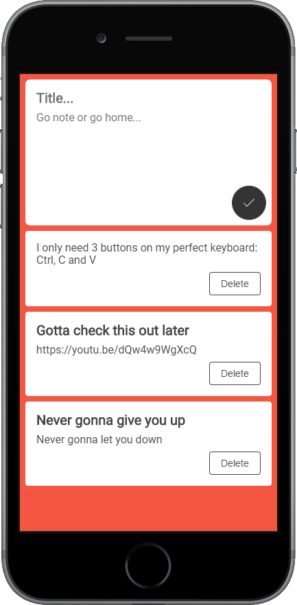

  
   
  <i>s stands for save, sync, and simple</i>

## What is s?
This is my personal yet public board for saving links, copypastas, etc.

### Live demo
[mlshv.me/s](http://mlshv.me/s)

### I make it because
* Sometimes I need quickly save something (like Google Keep) without logging in and simply open it later without remembering or writing down the link (like pastebin.com)
* I need a pet project to practice React / Redux

### TODO:
* Errors display
* Better desktop grid layout
* Broader, higher textarea

  

